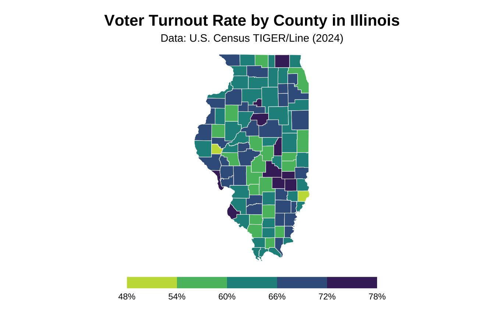
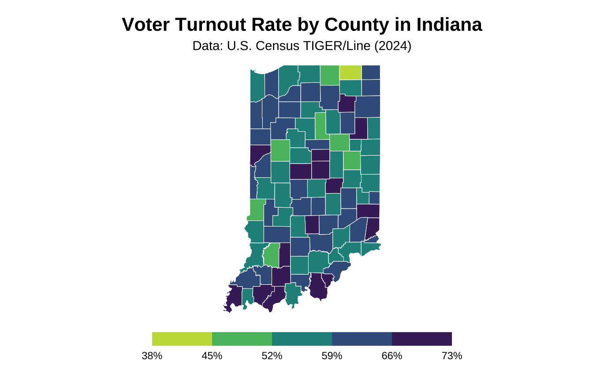
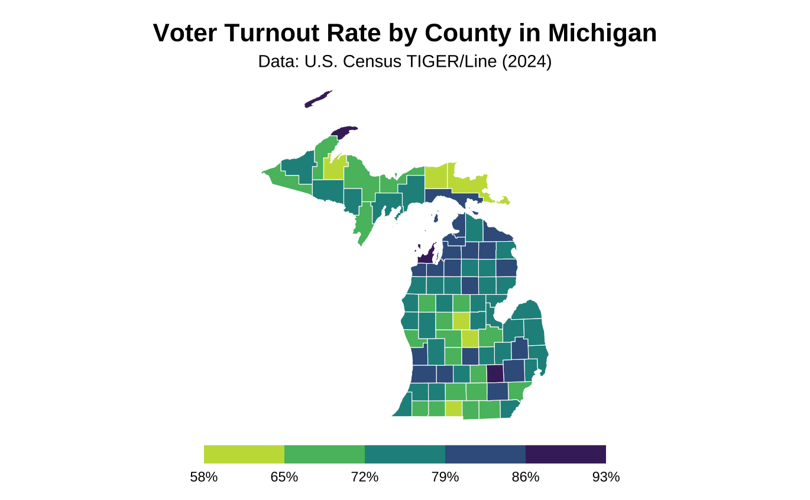
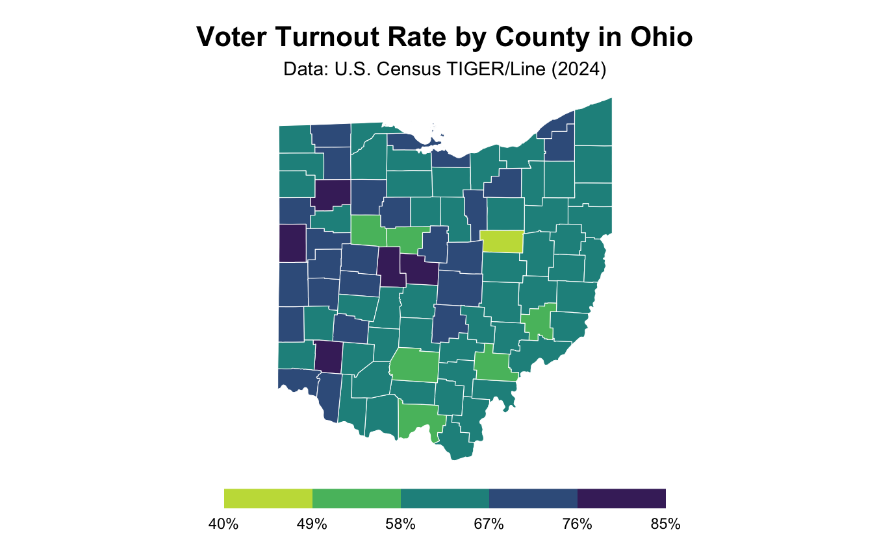
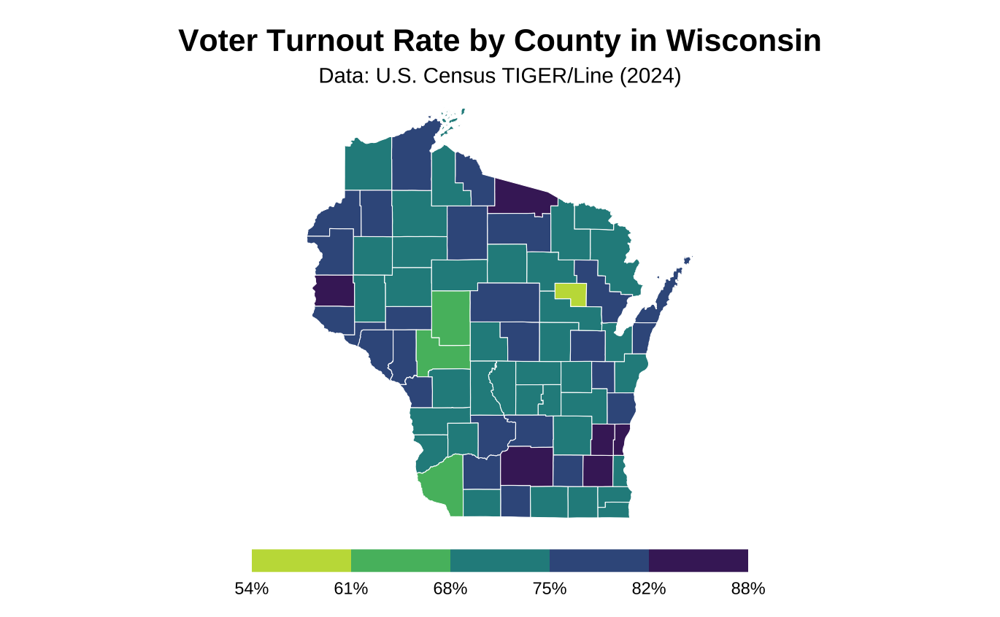
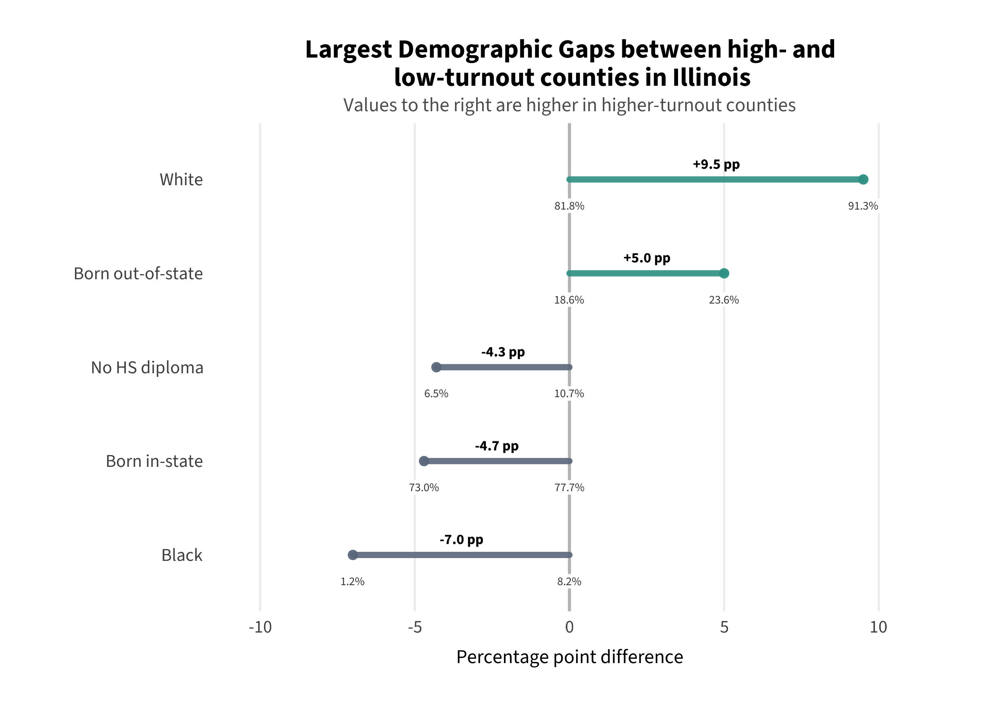
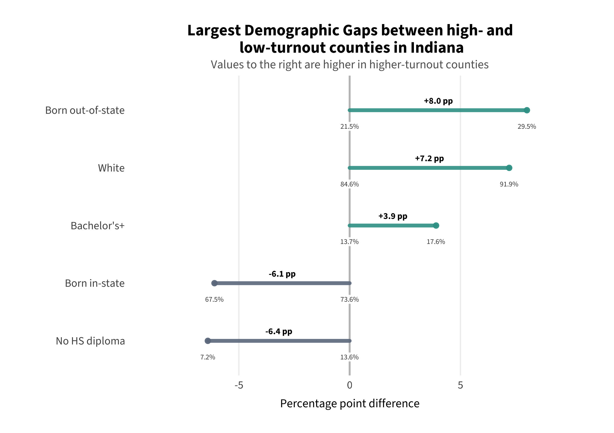
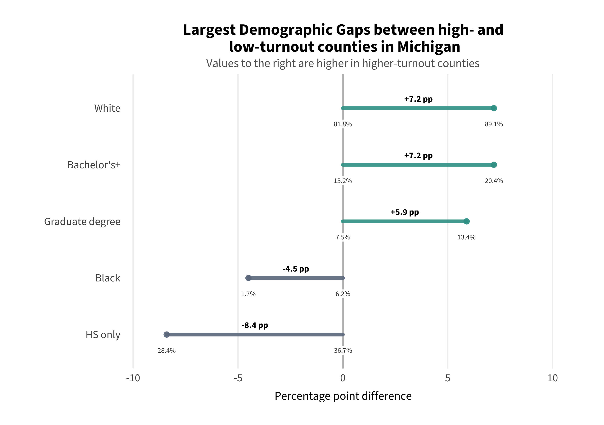
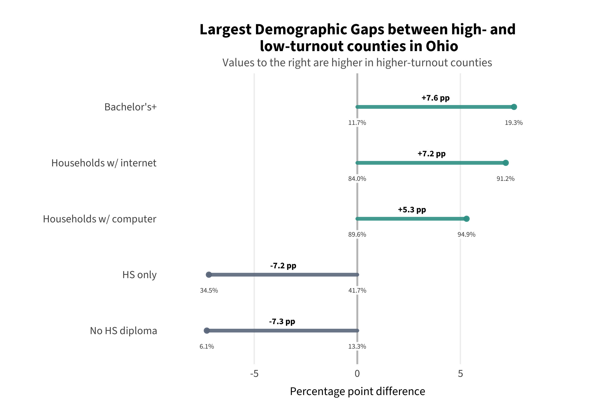
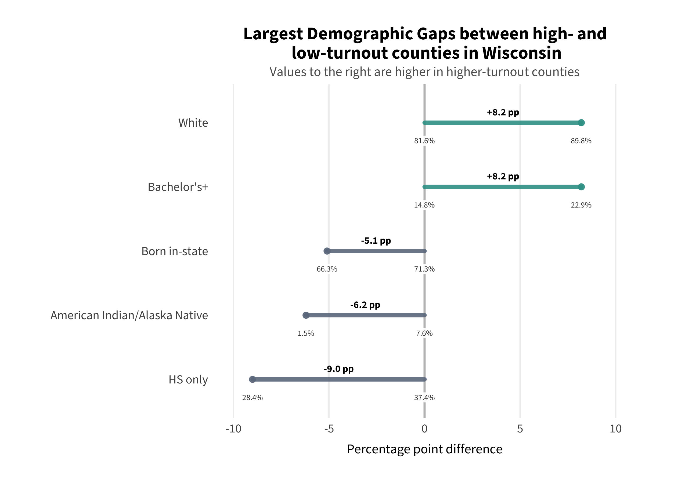

```{r setup, include=FALSE}
knitr::opts_chunk$set(echo = FALSE, warning = FALSE, message = FALSE)
```

<span class="section-label">Project Background</span>

## The CLC Needs Assessment

This project extends quantitative research conducted for the **Chicago Lawyers' Committee for Civil Rights (CLC)** as part of their Midwest regional expansion. The CLC is a legal nonprofit that provides direct legal services, litigation, advocacy, and community-based support with a focus on voting rights. As part of a needs assessment across Illinois, Indiana, Ohio, Wisconsin, and Michigan, the CLC sought to identify where turnout disparities are most concentrated and how they align with demographic patterns and institutional barriers.

My role was to lead the quantitative component of that assessment — analyzing county-level voter turnout from the 2024 Presidential General Election alongside demographic information from the American Community Survey. The analysis covered 437 counties across the five states.

The findings from that descriptive analysis directly motivated the predictive modeling approach in this capstone. The CLC work identified *what* the demographic patterns look like; this project asks *why some counties perform differently than their demographics predict*.

<div class="callout">
<strong>Research Questions (CLC Phase)</strong>
(1) Where are disparities in voter turnout most concentrated across Illinois, Michigan, Ohio, Indiana, and Wisconsin? (2) How do observed patterns align with demographic disparities and voting barriers?
</div>

---

<span class="section-label">State-Level Turnout</span>

## Voter Turnout by County

County-level turnout rates were calculated using Citizen Voting Age Population (CVAP) denominators from ACS estimates — the appropriate denominator for voting rights research because it reflects the legally eligible electorate. The choropleths below show the distribution of turnout across all counties in each state.

A consistent cross-state pattern emerges: **Wisconsin and Michigan show substantially higher overall turnout and smaller within-state gaps**, while **Indiana, Illinois, and Ohio show lower average turnout and wider variation between counties**. This state-level pattern is the empirical foundation for the institutional access argument developed in the predictive modeling phase.

### Illinois

```{r il-map, out.width="65%", fig.align="center", fig.cap="Voter turnout rate by county in Illinois, 2024 General Election. Turnout ranged from 48% to 78%."}

```

Illinois county-level turnout ranged from 48% to 78%. Counties in the highest quintile voted 15.5 percentage points more on average than those in the lowest quintile — a substantial within-state gap. Low-turnout counties clustered in rural west-central and southern Illinois.

### Indiana

```{r in-map, out.width="65%", fig.align="center", fig.cap="Voter turnout rate by county in Indiana, 2024 General Election. Turnout ranged from 38.5% to 77.9%."}

```

Indiana showed the widest within-state variation of the five states, with turnout ranging from 38.5% to 77.9% — a spread of nearly 40 percentage points. The highest-quintile counties voted 16.8 percentage points more than the lowest. Indiana's overall turnout floor is also the lowest of the five states, consistent with its restrictive institutional voting environment.

### Michigan

```{r mi-map, out.width="65%", fig.align="center", fig.cap="Voter turnout rate by county in Michigan, 2024 General Election. Turnout ranged from 57.7% to 93.2%."}

```

Michigan showed the highest turnout ceiling of any state in the analysis, with some counties reaching over 90%. The highest quintile averaged 18.7 percentage points above the lowest. Michigan ranked third nationally in eligible voter turnout in 2024, a result the Michigan Department of State attributed directly to expanded access policies passed under Proposal 2022-2.

### Ohio

```{r oh-map, out.width="65%", fig.align="center", fig.cap="Voter turnout rate by county in Ohio, 2024 General Election. Turnout ranged from 40.8% to 84.3%."}

```

Ohio turnout ranged from 40.8% to 84.3%, with the highest quintile averaging 17.6 percentage points above the lowest. Educational attainment and internet access were the largest demographic differentiators between low and high turnout counties in Ohio.

### Wisconsin

```{r wi-map, out.width="65%", fig.align="center", fig.cap="Voter turnout rate by county in Wisconsin, 2024 General Election. Turnout ranged from 53.6% to 87.5%."}

```

Wisconsin had the smallest within-state gap of the five states — just 13.5 percentage points between the average of the lowest and highest quintile counties. This compressed distribution is consistent with Wisconsin's permissive institutional environment, which may lift the floor for structurally disadvantaged counties.

---

<span class="section-label">Demographic Patterns</span>

## Who Lives in Low vs. High Turnout Counties?

For each state, counties were divided into turnout quintiles and demographic characteristics were compared between the lowest and highest quintile groups. The charts below show the largest demographic gaps — variables where low and high turnout counties differ most substantially. Values to the right of center are higher in high-turnout counties; values to the left are higher in low-turnout counties.

### Illinois

```{r il-gap, out.width="70%", fig.align="center", fig.cap="Largest demographic gaps between high- and low-turnout counties in Illinois."}

```

In Illinois, the largest demographic gaps between low and high turnout counties were racial composition (+9.5pp more white residents in high-turnout counties, -7.0pp Black residents) and place of origin (+5.0pp born out-of-state in high-turnout counties). Educational attainment also differed substantially, with low-turnout counties averaging 4.3 percentage points more residents with no high school diploma.

### Indiana

```{r in-gap, out.width="70%", fig.align="center", fig.cap="Largest demographic gaps between high- and low-turnout counties in Indiana."}

```

Indiana showed the largest education gap of any state — low-turnout counties averaged 6.4 percentage points more residents with no high school diploma, while high-turnout counties averaged 3.9 percentage points more bachelor's degree holders. Racial composition and place of origin were also prominent differentiators.

### Michigan

```{r mi-gap, out.width="70%", fig.align="center", fig.cap="Largest demographic gaps between high- and low-turnout counties in Michigan."}

```

Michigan's largest demographic gap was in educational attainment — low-turnout counties averaged 8.4 percentage points more residents with only a high school diploma. Racial composition was also a significant differentiator, with high-turnout counties averaging 7.2 percentage points more white residents and low-turnout counties averaging 4.5 percentage points more Black residents.

### Ohio

```{r oh-gap, out.width="70%", fig.align="center", fig.cap="Largest demographic gaps between high- and low-turnout counties in Ohio."}

```

Ohio showed the most pronounced technology access gap — high-turnout counties averaged 7.2 percentage points more households with internet access, nearly as large as the education gap. Educational attainment remained the largest differentiator overall.

### Wisconsin

```{r wi-gap, out.width="70%", fig.align="center", fig.cap="Largest demographic gaps between high- and low-turnout counties in Wisconsin."}

```

Wisconsin's largest gap was in education (9.0pp more HS-only residents in low-turnout counties) and racial composition, with low-turnout counties showing substantially higher American Indian/Alaska Native populations. Wisconsin's compressed overall distribution means these gaps are present but smaller in absolute terms than in Indiana or Ohio.

---

<span class="section-label">Cross-State Patterns</span>

## What the Descriptive Analysis Found

Across all five states, four demographic factors consistently differentiated low from high turnout counties:

**Educational attainment** was the most consistent and largest gap in every state. Low-turnout counties had substantially higher shares of residents with only a high school diploma or no diploma at all, while high-turnout counties had higher shares of bachelor's and graduate degree holders. This is consistent with established political participation theory (Kim, 2023; Leighley & Nagler, 2013).

**Racial composition** was a prominent differentiator in most states, with low-turnout counties generally having higher shares of Black residents and high-turnout counties higher shares of white residents. Wisconsin showed a distinct pattern with low-turnout counties having higher American Indian/Alaska Native populations. These patterns are consistent with documented racial turnout disparities (Morris & Grange, 2024; Barber & Holbein, 2022).

**Technology access** — specifically household internet — was a consistent gap, most pronounced in Ohio where it nearly matched the education gap. This likely reflects both resource constraints and the increasing role of online voter registration and information access.

**Disability status** appeared as a smaller but consistent differentiator, with low-turnout counties averaging higher disability rates across all five states.

<div class="callout finding">
<strong>The Gap This Analysis Cannot Fill</strong>
Descriptive analysis identifies <em>what</em> demographic patterns are associated with low turnout — but it cannot explain why some counties perform better or worse than their demographics predict. Two counties with identical demographic profiles can have very different turnout rates. Understanding that variation requires moving beyond description to prediction — which is the purpose of the modeling phase.
</div>

---

<span class="section-label">What Comes Next</span>

## From Description to Prediction

The descriptive findings establish that education, race, internet access, and disability status are the strongest demographic correlates of county-level turnout variation across the Midwest. These findings directly informed the predictor selection for the predictive model — and the robustness check adding racial composition and lower-tail education to the model was explicitly motivated by their prominence in the descriptive analysis.

The predictive model takes the next step: rather than asking which demographics are associated with low turnout, it asks which counties perform *above or below what their demographics predict* — and uses those residuals to identify cases for qualitative investigation.

- **[The Model →](model.html)** Full model specification, results, and residual distribution
- **[Case Studies →](case-studies.html)** Qualitative analysis of six selected counties
- **[Synthesis →](synthesis.html)** Cross-case patterns and implications

---

<div class="site-footer">
Data: U.S. Census Bureau American Community Survey (2024 5-Year Estimates); CVAP Special Tabulation; State Election Commissions (IL, IN, OH, WI, MI). Visualizations produced in R with ggplot2 and tigris. Analysis conducted as part of a quantitative needs assessment for the Chicago Lawyers' Committee for Civil Rights.
</div>
